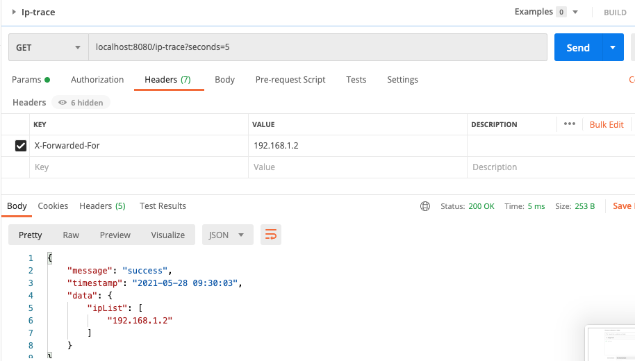
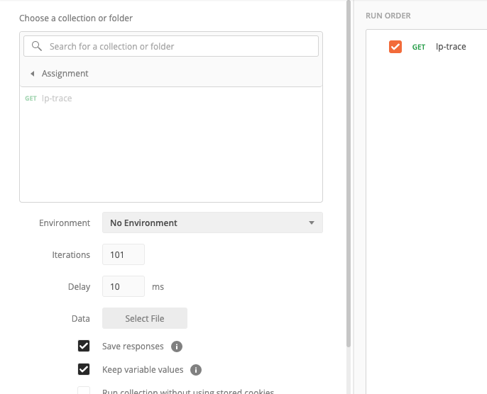
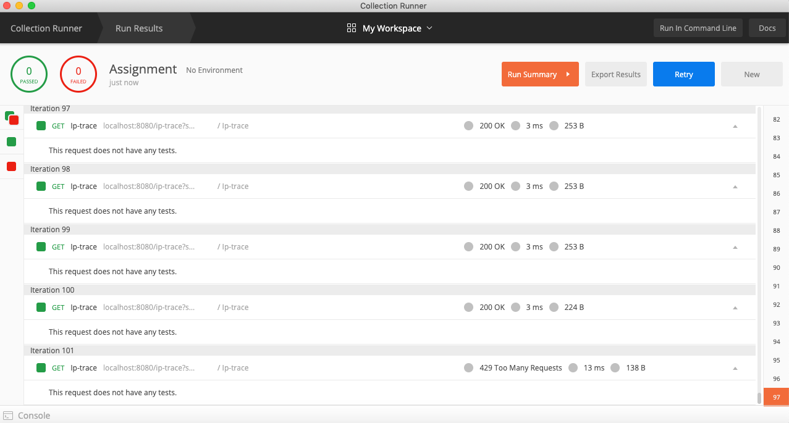

# Vetstoria Interview Assignment
### Overview

Declarative approach of rate limiting control over the Spring endpoints. 
`throttle` method helps you to limit the number of endpoint method calls per `java.util.concurrent.TimeUnit`
for a particular user, IP address.


### Examples

#### Part - A Assessment
For any valid list of IPv4 addresses, write a method that returns a list of matches to a partial address; or False if no matches are found. 
Some examples:

 * 192.168 will return any address that has 192.168 as two octets in the address
 * 254 will return any address that has 254 in any octet

The following rate limit configuration allows 1 method calls per SECOND for each unique `HttpServletRequest#getRemoteAddr()`.

```java
final String INET_4_ADDRESS = "192.168.1.1";
List<String> VALID_INET_4_ADDRESS_LIST = Stream.of(
                 "0.0.0.0",
                 "0.0.0.1",
                 "127.0.0.1",
                 "1.2.3.4",              // 0-9
                 "11.1.1.0",             // 10-99
                 "101.1.1.0",            // 100-199
                 "201.1.1.0",            // 200-249
                 "255.255.255.255",      // 250-255
                 "192.168.1.1",
                 "192.168.1.255",
                 "100.100.100.100",
                 "100.108.100.100",
                 "100.100.22.100"
         ).collect(Collectors.toList());
final List<String> matchedList = InetValidationUtils.anyMatch(VALID_INET_4_ADDRESS_LIST, INET_4_ADDRESS);

```

#### Defaults (Remote IP) - Part - B Assessment
Build a set of API methods for counting IP addresses. Each IP address should be counted, and the number of times any given IP address has visited should also be stored. (store the results in memory, this solution does not require a database). The following scenarios should be accounted in the solution
*	By default, any single IP address can have up to 100 hits in 1 minute. I
*	At any moment, a single API call should return all IP addresses that have visited in the last X seconds;
*	example: .get_all_ips(30) -> return a list of all IP addresses that visited at least once in the last 30 seconds

The following rate limit configuration allows 1 method calls per SECOND for each unique `HttpServletRequest#getRemoteAddr()`.

```java
 final boolean isLimitExceed = rateLimitService.throttle(request.getRemoteAddr(), TimeUnit.MINUTES,100);
if(!isLimitExceed){
    throw new RateLimitException();
}

```
```java
 final List<String> lastVisitedIps = rateLimitService.getAllIpAddr(int seconds);
 Syste.out.println(lastVisitedIps);

```

### How to build
```java
mvn clean package 
```

### How to test



